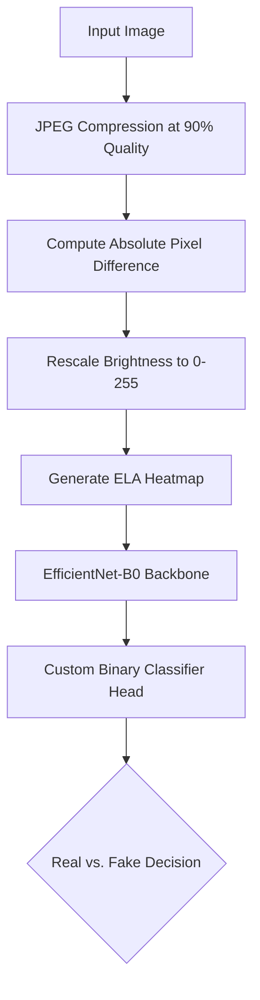

# Detecting Deepfakes Using Error Level Analysis and Transfer Learning

Welcome to my final project repository for deepfake detection. This project explores digital image forensics by utilizing Error Level Analysis (ELA) to identify JPEG compression anomalies. These forensic signatures are fed into a fine-tuned EfficientNet-B0 network to classify images as real or manipulated (deepfakes).

---

## Project Structure

This repository is organized as follows:

*   **`src/`**: Contains the source code.
    *   [`generate_ela.py`](file:///c:/Users/perso/OneDrive/MyCode/Deep%20Learning%20Project/src/generate_ela.py): Script to convert raw images into ELA heatmaps.
    *   [`train_model.py`](file:///c:/Users/perso/OneDrive/MyCode/Deep%20Learning%20Project/src/train_model.py): PyTorch training script utilizing differential learning rates on EfficientNet-B0.
*   **`report/`**: Contains the CVPR 2025 LaTeX source code and the compiled PDF for the final report.
    *   [`main.tex`](file:///c:/Users/perso/OneDrive/MyCode/Deep%20Learning%20Project/report/main.tex): Main LaTeX document.
    *   [`Detecting Deepfakes Using Error Level Analysis and Transfer Learning.pdf`](file:///c:/Users/perso/OneDrive/MyCode/Deep%20Learning%20Project/report/Detecting%20Deepfakes%20Using%20Error%20Level%20Analysis%20and%20Transfer%20Learning.pdf): The compiled PDF report.
*   **`poster/`**: Contains the LaTeX code and assets for the presentation poster.
    *   [`poster.tex`](file:///c:/Users/perso/OneDrive/MyCode/Deep%20Learning%20Project/poster/poster.tex): The `tikzposter` LaTeX document.
    *   [`bau_logo.png`](file:///c:/Users/perso/OneDrive/MyCode/Deep%20Learning%20Project/poster/bau_logo.png): Bahçeşehir University logo card.
*   **[`best_model.pth`](file:///c:/Users/perso/OneDrive/MyCode/Deep%20Learning%20Project/best_model.pth)**: The saved weights of the best-performing model.
*   **[`results.txt`](file:///c:/Users/perso/OneDrive/MyCode/Deep%20Learning%20Project/results.txt)**: Text file recording the final validation metrics.

---

## Workflow Diagram

The pipeline below shows how an input image is preprocessed using ELA and classified by the fine-tuned network:



---

## Dataset Access (Google Drive)

Following the course submission guidelines, the 1GB training dataset (FaceForensics++ subset of 10,000 frames) is hosted on Google Drive to keep the code package compact and submission-friendly.

*   **Dataset Access Link:** `https://drive.google.com/file/d/19_qYjr0LADLoQz_Ip1BQlLiNQKyr7Obg/view?usp=sharing`
*   **Instructions:**
    1. Download the dataset from the link above.
    2. Extract the folder into the root directory of this project as `1GB_dataset/`.
    3. The folder structure should look like this:
       ```text
       1GB_dataset/
       ├── raw/
       │   ├── real/      (5,000 real images)
       │   └── fake/      (5,000 deepfake images)
       └── ela/           (Automatically populated by the preprocessing script)
       ```

---

## Environment Setup and Installation

This project requires Python 3.8 or higher. An NVIDIA GPU with CUDA support is highly recommended for model training.

### 1. Install PyTorch with CUDA (Recommended)
Install the appropriate PyTorch build for your CUDA version. For CUDA 12.1, run:
```bash
pip install torch torchvision --index-url https://download.pytorch.org/whl/cu121
```

### 2. Install Additional Dependencies
Install the required image processing and analysis tools:
```bash
pip install pillow scikit-learn
```

---

## Execution Guide

### Step 1: Preprocess Images
To generate the Error Level Analysis (ELA) heatmaps from the raw images, run:
```bash
python src/generate_ela.py
```
This script processes the raw inputs and splits them into training and validation sets under `1GB_dataset/ela/train` and `1GB_dataset/ela/val`.

### Step 2: Train and Evaluate the Model
To train the EfficientNet-B0 model with a differential learning rate strategy, run:
```bash
python src/train_model.py
```
The script will print progress per epoch, save the highest-performing weights to `best_model.pth`, and write evaluation results to `results.txt`.

---

## Compiling the LaTeX Deliverables

You can compile the report and poster LaTeX source code locally or online.

### 1. Online via Overleaf (Easiest)
1. Zip the `report/` folder and upload it to Overleaf. Set the main document to `main.tex` and compile.
2. Zip the `poster/` folder and upload it to Overleaf. Set the main document to `poster.tex` and compile.

### 2. Locally via Command Line
Run the following commands if you have a local LaTeX distribution installed (such as TeX Live or MiKTeX):

**For the Written Report:**
```bash
cd report
pdflatex main.tex
bibtex main
pdflatex main.tex
pdflatex main.tex
```

**For the Poster:**
```bash
cd poster
pdflatex poster.tex
```

---

## Performance Summary

The model was evaluated using a balanced validation set of 2,000 images (1,000 real and 1,000 fake). The performance metrics achieved are:

| Metric | Score |
| :--- | :--- |
| **Accuracy** | 86.40% |
| **F1-Score** | 86.11% |
| **Precision** | 88.00% |
| **Recall** | 84.30% |
